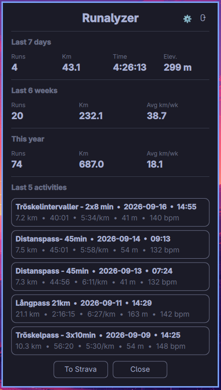

# Runalyzer

A bar widget for [Omarchy](https://omarchy.org) that shows your recent Strava
running activities, weekly trends, and yearly totals — right in your status
bar.



**Latest release:** [v0.6.0](https://github.com/grunkan/runalyzer/releases/tag/v0.6.0) — see all [releases](https://github.com/grunkan/runalyzer/releases) for the changelog.

## Features

- Your latest runs — name, date, time, distance, duration, pace, elevation
  gain, and average heart rate. Click a run to open it on Strava; hover for
  a "View on Strava" tooltip.
- **Last 7 days** summary: runs, km, time, elevation gain.
- **Weekly trend** over 2–12 weeks: runs, km, average km/week, a bar chart of
  kilometres per week, and how the period compares to the one before it.
- **This year** totals: runs, km, average km/week.
- Your current streak of consecutive weeks with at least one run.
- **Long run ceiling** — the longest run of the last 30 days, and the distance
  above which a single run becomes a large jump.
- **Efficiency trend** — metres covered per heartbeat on easy runs, compared
  with the preceding period.
- **Load & intensity** — Relative Effort over the last 7 days against your
  4-week average, and the share of sessions kept easy.
- Toggle any of the four sections on/off, and choose how many weeks the trend
  covers and how many activities the list shows.

All time windows are rolling: "last 7 days" is today plus the six days before
it, and a trend of N weeks is today plus the preceding N×7−1 days. Changing a
setting recomputes everything immediately — no waiting for the next sync.

## Requirements

- [Omarchy](https://omarchy.org) (`omarchy-shell`)
- Python 3 — standard library only, no `pip install` needed
- A Strava account and your own free Strava API application (see Setup below)

## Installation

Via the Omarchy plugin CLI:

```sh
omarchy plugin add https://github.com/grunkan/runalyzer.git --enable
```

Or manually:

```sh
git clone https://github.com/grunkan/runalyzer.git ~/.config/omarchy/plugins/grunkan.runalyzer
omarchy-shell shell rescanPlugins
omarchy plugin enable grunkan.runalyzer
```

## Setup: connecting your Strava account

Strava requires every app to use its own API credentials, so you'll need to
create a small (free) API application for your own account:

1. Go to [strava.com/settings/api](https://www.strava.com/settings/api) and
   create an application.
   - Set **Authorization Callback Domain** to `localhost`.
   - Note: the application requires a **Website** and an **Application
     Icon**. Use `https://github.com/grunkan/runalyzer` as the website, and
     upload [`assets/icon.png`](assets/icon.png) from this repo as the icon.
2. Copy the **Client ID** and **Client Secret** it gives you.
3. Click the Runalyzer icon in your bar, paste the Client ID and Client
   Secret into the fields shown, and click **Connect**.
4. Your browser opens Strava's login/authorize page — approve access.
5. Runalyzer syncs automatically from then on.

Your credentials and tokens are stored locally in
`~/.local/state/omarchy/strava/auth.json` (file permissions `600`) and are
only ever sent directly to Strava's own API — nowhere else.

## Configuration

Click the gear icon in the popup to:

- Toggle which of the four sections (Last 7 days / Weekly trend / This year /
  Recent activities) are shown.
- Set how many weeks the trend covers (2–12, default 6).
- Set how many activities the list shows (3–10, default 5).
- Set the auto-refresh interval in minutes (5–60, default 15).
- Set your max heart rate manually, or let it be taken from the highest rate
  recorded in your history.

Settings are stored per widget in `~/.config/omarchy/shell.json` and survive
reinstalling the plugin.

## How the two training metrics work

**Long run ceiling.** A large single run relative to recent training is the
best-evidenced injury risk in the running literature: in a cohort of 5,205
runners, a run 30–100% longer than the longest of the previous 30 days came
with a markedly higher rate of overuse injury. The widget therefore shows that
30-day longest run and the distance 30% above it, as a number to plan against.
It is deliberately framed as a ceiling rather than a warning, and there is no
weekly-percentage alarm — the familiar "10% per week" rule has never been
validated.

**Efficiency trend.** Metres covered per heartbeat, averaged over easy runs and
compared with the preceding period of the same length. Rising efficiency on
comparable runs suggests improving aerobic fitness. The comparison is only
meaningful like-for-like, so a run counts as easy only when its average heart
rate is at most 80% of maximum, its peak stays at or below 88% — which keeps
interval sessions out, since warm-up and recovery pull their average down —
and it climbs less than 10 m per km. The panel shows how many runs qualified,
so a figure built on three runs is not mistaken for one built on fifteen.

**Load & intensity.** Relative Effort is Strava's own measure of how hard a
session was, weighted by time spent in each heart rate zone, so a week of it
says more than a week of kilometres does. The panel shows the last 7 days
against your 4-week daily average, as a percentage.

It is framed as a change against your own norm, not as an acute:chronic
workload ratio. That ratio is widely quoted, but its link to injury has not
held up: a 2025 meta-analysis could not rule out zero for the supposedly safe
band, and the evidence base is dominated by team sports. A number presented as
risk gets read as risk, so this one is presented as context.

Alongside it is the share of the last 28 days' sessions that stayed easy,
meaning an average heart rate at or below 80% of maximum. Two caveats matter.
It counts **sessions, not time in zones** — the 80/20 principle refers to the
latter, which needs per-second data the widget does not fetch, and the two
measures can differ by ten points or more for the same training. And sessions
without heart rate are left out of both halves of the fraction rather than
silently counted as easy.

## License

MIT — see [LICENSE](LICENSE).
